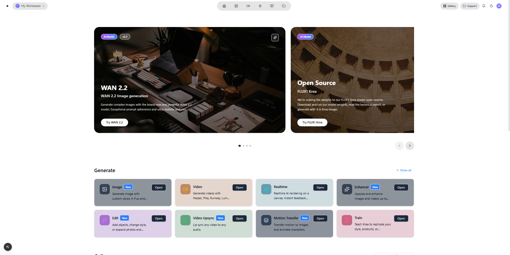
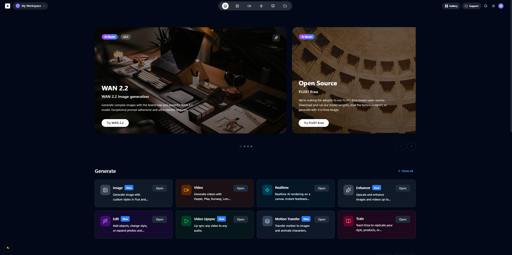

# Krea AI Clone - Frontend Interface

A pixel-perfect clone of the Krea AI interface built with Next.js 15, TypeScript, and Tailwind CSS. This project showcases modern web development practices and responsive design patterns.

## 🚀 Live Demo

**[View Live Demo](https://your-vercel-deployment-url.vercel.app)**

## 📸 Screenshots

### Light Mode


### Dark Mode


## ✨ Features

- **🎨 Pixel-Perfect Design** - Exact replica of the original Krea AI interface
- **🌓 Dark/Light Mode Toggle** - Seamless theme switching with system preference detection
- **📱 Fully Responsive** - Optimized for desktop, tablet, and mobile devices
- **⚡ Next.js 15** - Latest Next.js with Turbopack for lightning-fast development
- **🎭 Framer Motion** - Smooth animations and micro-interactions
- **🎯 TypeScript** - Full type safety and enhanced developer experience
- **🎨 Tailwind CSS 4** - Modern utility-first CSS framework
- **🔧 Component Architecture** - Modular and reusable component system

## 🛠️ Tech Stack

### Frontend Framework
- **Next.js 15** - React framework with App Router
- **React 19** - Latest React with concurrent features
- **TypeScript 5** - Static type checking

### Styling & UI
- **Tailwind CSS 4** - Utility-first CSS framework
- **Radix UI** - Headless UI components
- **Lucide React** - Beautiful & consistent icons
- **Framer Motion** - Production-ready motion library

### Development Tools
- **ESLint** - Code linting and formatting
- **Turbopack** - Ultra-fast bundler for development

## 🚦 Getting Started

### Prerequisites

Make sure you have the following installed:
- **Node.js** (v18 or higher)
- **npm** or **yarn** package manager
- **Git**

### Installation

1. **Clone the repository**
   ```bash
   git clone https://github.com/war-riz/krea-ai-clone.git
   cd krea-ai-clone
   ```

2. **Install dependencies**
   ```bash
   npm install
   # or
   yarn install
   ```

3. **Run the development server**
   ```bash
   npm run dev
   # or
   yarn dev
   ```

4. **Open your browser**
   
   Navigate to [http://localhost:3000](http://localhost:3000) to see the application.

## 📁 Project Structure

```
krea-ai-clone/
├── src/
│   ├── app/                    # Next.js App Router
│   │   ├── globals.css         # Global styles
│   │   ├── layout.tsx          # Root layout
│   │   └── page.tsx           # Home page
│   ├── components/            # Reusable components
│   │   ├── ui/               # Base UI components
│   │   ├── layout/           # Layout components
│   │   ├── cards/            # Card components
│   │   └── theme/            # Theme components
│   ├── constants/            # App constants
│   ├── types/               # TypeScript type definitions
│   ├── lib/                 # Utility functions
│   └── hooks/               # Custom React hooks
├── public/                   # Static assets
├── tailwind.config.ts       # Tailwind configuration
├── next.config.ts          # Next.js configuration
└── package.json           # Project dependencies
```

## 🎯 Key Components

### Layout Components
- **Header** - Navigation with search and user menu
- **Footer** - Company info, links, and newsletter subscription
- **Gallery** - Image showcase with filtering capabilities

### Card Components
- **FeaturedCards** - Highlighted AI models and tools
- **ModelCardsGrid** - Grid layout for AI model showcase

### Theme System
- **ThemeProvider** - Context-based theme management
- **ThemeToggle** - Dark/light mode switcher

## 📱 Responsive Design

The application is fully responsive with breakpoints:
- **Mobile**: 320px - 768px
- **Tablet**: 768px - 1024px
- **Desktop**: 1024px+

## 🎨 Design System

### Colors
- **Primary**: Custom brand colors
- **Background**: Dynamic based on theme
- **Foreground**: High contrast text colors
- **Muted**: Secondary text and backgrounds

### Typography
- **Headings**: Bold, modern font weights
- **Body**: Readable and accessible text
- **Captions**: Subtle, muted text for metadata

## 📦 Build & Deployment

### Build for Production
```bash
npm run build
npm run start
```

### Deploy to Vercel
1. **Connect to Vercel**
   ```bash
   npm i -g vercel
   vercel login
   vercel
   ```

2. **Automatic Deployment**
   - Push to `main` branch for automatic deployment
   - Vercel will automatically detect Next.js and optimize the build

### Environment Variables
Create a `.env.local` file for environment-specific variables:
```env
NEXT_PUBLIC_APP_URL=https://your-domain.com
```

## 🔧 Available Scripts

- `npm run dev` - Start development server with Turbopack
- `npm run build` - Build for production with Turbopack
- `npm run start` - Start production server
- `npm run lint` - Run ESLint for code quality

## 🤝 Contributing

This project was created as part of a technical assessment for **Cartolinks Solutions LTD - Software Engineering Internship**.

### Development Guidelines
1. Follow TypeScript best practices
2. Maintain component modularity
3. Ensure responsive design
4. Test across different browsers
5. Keep accessibility in mind

## 📄 Assignment Context

**Tech Internship Application - Frontend & Mobile Developer Positions**

**Assignment Requirements:**
- ✅ Build pixel-perfect frontend interface
- ✅ Implement dark/light mode toggle  
- ✅ Use Next.js and Tailwind CSS
- ✅ Deploy working demo on Vercel
- ✅ Provide clean, documented code

## 👨‍💻 Author

**war_riz**
- GitHub: [@war-riz](https://github.com/war-riz)
- Portfolio: [Your Portfolio URL]

## 📝 License

This project is created for educational and assessment purposes. All design credits go to the original Krea AI team.

## 🙏 Acknowledgments

- **Krea AI** - Original design inspiration
- **Cartolinks Solutions LTD** - Technical assessment opportunity
- **Vercel** - Deployment platform
- **Next.js Team** - Amazing React framework

---

**Built with ❤️ for Cartolinks Solutions LTD Software Engineering Internship**